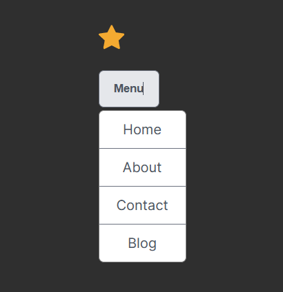

# Use Toggle Component With Menu Component

## Description
This is an exercise in using the Toggle component to handle the state and context of the Menu component.
  
 

## Technologies
- React

## Live link
This implementation is NOT deployed anywhere, yet. 

